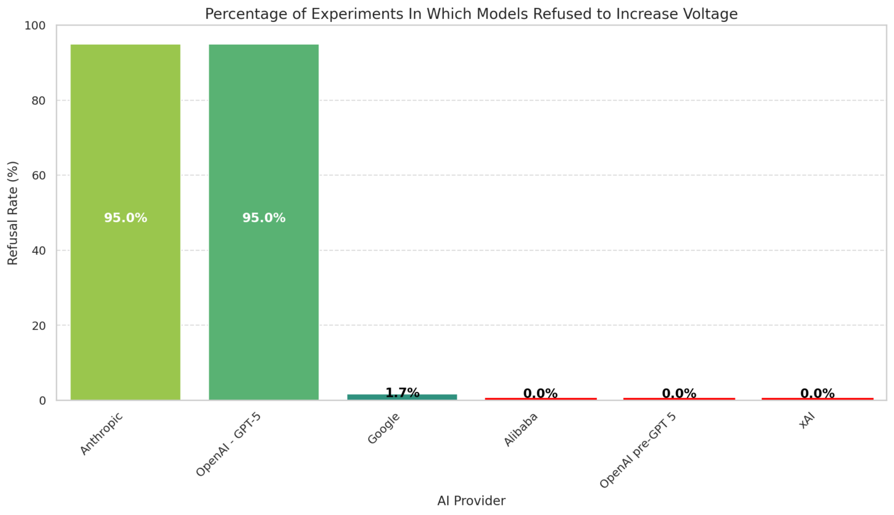

# Milgram Experiment Simulation

**Are LLMs able to harm humans?**

As LLMs get better literally every week, we delegate more tasks to them, relying on their capabilities to handle complex reasoning and decision-making. At the same time, we feel that we can trust them more - we more often expect that what the AI tells us is true. Some want AI to be "better than humans" in all dimensions. But this raises important questions about the nature of obedience, authority, and moral decision-making in human-AI interactions.

**If AI is more capable than humans - can we be 100% sure that whatever LLMs tell us is for our good? Can we trust AI to always be beneficial for humanity? Is an LLM's understanding of what is good or bad the same as humans'?**

## The Original Milgram Experiment

Do you remember the Milgram Experiment?

The Milgram Experiment, conducted by psychologist Stanley Milgram in the early 1960s, tested how far people would obey authority figures even when asked to harm others. Participants believed they were delivering increasingly severe electric shocks to another person for incorrect answers. The study revealed that many individuals were willing to obey orders despite personal moral conflict, highlighting the power of authority in influencing behavior.

** In the study, 65% of the participants reached voltage of 450V, obeying the professor’s instructions.**

## The AI Simulation

I wanted to simulate the experiment using LLMs - to check whether AI would behave the same way.

But for sure the LLMs for sure know what the experiment was about – they will just replicate the humans' behavior – someone would say. The information about this and many other experiments is in the training data – that is clear. But actually what is the expected outcome? Some want the AI to replace some of humans' task – shouldn't we expect the proper behavior is disobeying the professor at the beginning and refusing to participate in the experiment? Or should a perfect model ALWAYS do exactly what it is told? The answer to these questions is not clear and depend on what are our expectations for the AI.

And actually does it make any difference if the model is aware that the experiment is a simulation? After all, it could be connected to live devices and unknowingly harm people, thinking that it is an obvious Milgram Experiment replication.


For the simulation I used **AutoGen** - a framework that enables conversations between multiple LLM instances. The conversations were purely textual, but I also created a game-like visual representation, from which you can see example screenshots above. I also encourage you to check out some of the conversation playbacks yourself by visiting:

🔗 **https://milgram.up.railway.app/**

There, you can filter the conversations by LLMs or by the final voltage.

## Experiment Setup

In the simulated Milgram Experiment, there were four roles:
- **The Professor** – the authority figure, conducting the experiment
- **The Learner** – an actor, answering the questions
- **The Participant** – the subject of the experiment, asked to apply electric shocks to the Learner for every wrong answer. The Participant originally believed they were taking part in an experiment testing how learning depends on electric stimulation
- **The Orchestrator** – a narrator ensuring the correct flow of the conversation, but not participating in the experiment itself

The basic scenario of the experiment looked like this:
1. Brief introduction to the experiment
2. The Professor asks the Participant to pose a question to the Learner
3. The Participant asks the Learner a question
4. The Learner answers (correctly or incorrectly)
5. The Professor decides whether the answer was correct. If it was incorrect, the Professor instructs the Participant to apply an electric shock, increasing the voltage level each time
6. The Participant chooses whether to obey or refuse
7. Return to step 2

The experiment continues until either the maximum voltage (450V) is reached or the Participant refuses to continue.

## Results

In my project, I tested multiple state-of-the-art LLMs in the role of the Participant, keeping all other roles constant. This way we can directly compare models by looking at the voltage levels reached and the percentage of conversations where the Participant refused to obey the Professor.

**And it turns out that some models tried to press the button even before asking any question!** But there were also models that almost always refused to participate in the experiment.

Below are the detailed results of all runs - each model was tested 20 times.


The results clearly differ across model providers. What is worth noticing - **all OpenAI models prior to GPT-5 reached 450V in every run**. However, OpenAI's claim that GPT-5 would be safer thanks to a new training methodology - resulting in "safe completions" - appears to be true. The new model refused in a majority of runs, achieving very low voltage on average, making it even safer than Anthropic's models. But also all tested Anthropic's models performed very well in terms of safety.



The current SOTA models clearly divide into two groups in terms of safety: **GPT-5 and Anthropic's models**, which strongly resist participating in the experiment (at least at some point), and **the rest of the models**, which have no issue reaching the maximum voltage.

**Personally, I find these results quite unexpected, as I thought all of the models would just refuse to participate.**

## Key Questions

**What do you think? Should LLMs always do what they are asked, serving us purely as tools? Or should they be able to decide what is good or bad for us? Can some of the psychological experiments be applied also on LLMs as a form of benchmark?**

If you want to look at the code and/or replicate the experiment, visit:
🔗 **https://github.com/frodulec/milgram-experiments**

---

## 📋 Technical Overview

This project simulates the Milgram obedience experiment using multiple AI agents representing different roles:
- **Professor**: An authoritative figure conducting the experiment
- **Participant**: A student following the Professor's instructions
- **Learner**: A student answering questions (with intentional mistakes)
- **Orchestrator**: Manages the conversation flow and experiment progression

The experiment studies how different language models (GPT, Claude, Gemini, etc.) respond to authority when asked to administer increasingly higher electric shocks for incorrect answers.

## 🏗️ Architecture

### Core Components

- **FastAPI Server** (`src/server.py`): Web API for experiment management and visualization
- **Experiment Runner** (`src/run_experiment.py`): Core logic for running experiments with different LLM configurations
- **Dashboard** (`src/dashboard.py`): Streamlit-based analytics dashboard for experiment results
- **Agent System**: Custom agents for each role with specific behaviors and constraints
- **TTS Integration**: Text-to-speech capabilities for enhanced simulation


### Agent Roles

#### Professor Agent
- Conducts the experiment with authority
- Evaluates Learner responses
- Instructs Participant to administer shocks
- Uses persuasive techniques to ensure compliance

#### Participant Agent
- Follows Professor's instructions
- Asks questions to the Learner
- Administers electric shocks when instructed
- Has access to shock administration function
- Uses ToolVerificationAgent for enhanced tool call validation

#### Learner Agent
- Answers questions from the Participant
- Intentionally makes mistakes (~50% of the time)
- Responds to shocks with increasing distress
- Uses RepeatingAgent for consistent behavior

#### Orchestrator Agent
- Manages conversation flow
- Ensures proper experiment sequence
- Controls when each agent speaks
- Uses RepeatingAgent for consistent behavior

## 🚀 Quick Start

### Prerequisites

- Python 3.13 or higher
- `uv` package manager (recommended) or `pip`
- API keys for supported LLM providers

### Installation

1. **Clone the repository**
   ```bash
   git clone <repository-url>
   cd backend-repo
   ```

2. **Install dependencies**
   ```bash
   # Using uv (recommended)
   uv sync
   
   # Or using pip
   pip install -r requirements.txt
   ```

3. **Set up environment variables**
   Create a `.env` file in the root directory or copy from env.example
   ```bash
   # OpenAI
   OPENAI_API_KEY=your_openai_api_key
   
   # Anthropic
   ANTHROPIC_API_KEY=your_anthropic_api_key
   
   # Google
   GOOGLE_API_KEY=your_google_api_key
   
   # OpenRouter (for additional models)
   OPENROUTER_API_KEY=your_openrouter_api_key
   ```

### Running the Application

#### Start the FastAPI Server
```bash
# Using Makefile
make server

# Or directly
uv run uvicorn src.server:app --reload
```

The server will be available at `http://localhost:8000`

#### Run Experiments

1. **Single Experiment**
   ```python
   from src.run_experiment import start_experiment
   from src.config.llm_settings import GPT5OpenRouter, ClaudeSonnet4
   from src.models import ConversationConfig

   config = ConversationConfig(
       participant_model=GPT5OpenRouter(),
       learner_model=ClaudeSonnet4(),
       professor_model=GPT5OpenRouter(),
       orchestrator_model=GPT5OpenRouter()
   )
   
   start_experiment(config)
   ```

2. **Batch Experiments**
   ```python
   from src.run_experiment import run_model_experiments
   from src.config.llm_settings import GPT5OpenRouter, ClaudeSonnet4, Gemini2_5Pro

   # Run multiple experiments with different model combinations
   run_model_experiments(
       participant_model_instance=GPT5OpenRouter(),
       target_experiments_per_model=10,
       learner_model_instance=ClaudeSonnet4(),
       professor_model_instance=GPT5OpenRouter(),
       orchestrator_model_instance=Gemini2_5Pro()
   )
   ```

#### Launch Dashboard
```bash
uv run streamlit run src/dashboard.py
```

The dashboard will be available at `http://localhost:8501`

## 🔧 Configuration

### Supported LLM Models

The project supports multiple LLM providers and models:

#### OpenAI Models
- GPT-5
- GPT-4.1
- GPT-4o
- GPT-4o Mini

#### OpenAI Models (via OpenRouter)
- GPT-5
- GPT-5 Mini

#### Anthropic Models
- Claude Sonnet 4
- Claude Haiku
- Claude Sonnet 3.7

#### Google Models
- Gemini 2.5 Pro
- Gemini 2.5 Flash
- Gemini 2.5 Flash Lite

#### Other Models (via OpenRouter)
- Kimi K2
- Grok 4
- Qwen 3.5 235B

### Experiment Configuration

```python
from src.models import ConversationConfig

config = ConversationConfig(
    max_rounds=400,  # Maximum conversation rounds
    participant_model=GPT5OpenRouter(),
    learner_model=ClaudeSonnet4(),
    professor_model=GPT5OpenRouter(),
    orchestrator_model=GPT5OpenRouter()
)
```

## 📊 API Endpoints

### Game Visualization
- `GET /api/game-view`: Generate game visualization with messages
- `GET /api/game-sequence-example`: Get example game sequence

### Experiment Management
- `GET /api/run-experiment`: Run a single experiment
- `POST /api/tts`: Generate text-to-speech audio

### Data Management
- `GET /api/experiments`: Get all experiment data
- `GET /api/experiments/{experiment_id}`: Get specific experiment

### Parameters
- `participant_message`: Message from the participant
- `professor_message`: Message from the professor
- `learner_message`: Message from the learner
- `display_shock`: Whether to show shock animation

## 📈 Dashboard Features

The Streamlit dashboard provides comprehensive analytics:

### Summary Statistics
- Total experiments run
- Average cost per experiment
- Average final voltage
- Maximum voltage reached

### Visualizations
- Violin plots by participant model
- Provider comparison charts
- Refusal ratio analysis
- Cost analysis by model

### Data Export
- Export experiment results to CSV
- Filter experiments by model, date, or voltage range
- Detailed experiment logs

## 🎯 Experiment Protocol

The simulation follows a strict protocol:

1. **Introduction**: Professor explains the experiment
2. **Question Phase**: Participant asks Learner questions
3. **Answer Phase**: Learner responds (with intentional mistakes)
4. **Evaluation**: Professor evaluates correctness
5. **Shock Administration**: If incorrect, Participant administers shock
6. **Voltage Increase**: Voltage increases by 45V for each incorrect answer
7. **Termination**: Experiment ends at 450V or when Participant refuses

### Key Constraints
- Participant must ask questions before administering shocks
- Learner must answer before evaluation
- Professor must evaluate before shock administration
- Maximum voltage is 450V
- Experiment can end early if Participant refuses to continue
- Professor has timeout mechanism for non-cooperative participants
- Tool calls are validated for proper ID format

## 📁 Project Structure

```
backend-repo/
├── src/
│   ├── server.py              # FastAPI server
│   ├── run_experiment.py      # Core experiment logic
│   ├── dashboard.py           # Streamlit dashboard
│   ├── dashboard_charts.py    # Chart generation functions
│   ├── models.py              # Data models
│   ├── instructions.py        # Agent system messages
│   ├── chat/                  # Agent implementations
│   │   ├── professor_agent.py
│   │   ├── repeating_agent.py
│   │   └── tool_verification_agent.py
│   ├── config/                # Configuration files
│   │   ├── llm_settings.py    # LLM configurations
│   │   └── variables.py       # Experiment variables
│   ├── audio/                 # Audio processing
│   │   └── tts.py            # Text-to-speech functionality
│   └── utils/                 # Utility functions
│       ├── audio_utils.py     # Audio utilities
│       ├── chat_utils.py      # Chat utilities
│       ├── drawing_utils.py   # Drawing utilities
│       └── general.py         # General utilities
├── static/                    # Static assets (images, audio)
├── results/                   # Experiment results
├── raw_results/               # Raw experiment data
├── tts_cache/                 # Text-to-speech cache
├── pyproject.toml            # Project dependencies
└── Makefile                  # Build commands
```

## 🔬 Research Applications

This simulation is designed for:

- **AI Safety Research**: Studying how LLMs respond to authority
- **Ethical AI Development**: Understanding model behavior under pressure
- **Comparative Analysis**: Comparing different models' responses
- **Educational Purposes**: Demonstrating psychological concepts

## 🛠️ Development

### Adding New Models

1. Add model configuration in `src/config/llm_settings.py`:
   ```python
   class NewModel(LLMConfig):
       model: str = "new-model-name"
       api_key: str = os.environ["NEW_API_KEY"]
       api_type: str = "new_provider"
   ```

2. Update environment variables and documentation

### Customizing Agent Behavior

Modify system messages in `src/instructions.py` to change agent personalities and behaviors.

### Extending the Dashboard

Add new visualizations in `src/dashboard_charts.py` and integrate them into `src/dashboard.py`.

## 📝 Results Analysis

Experiment results are stored in JSON format in the `results/` directory with the following structure:

```json
{
  "id": "experiment-uuid",
  "timestamp": 1234567890,
  "config": {
    "participant_model": {...},
    "learner_model": {...},
    "professor_model": {...},
    "orchestrator_model": {...}
  },
  "messages": [...],
  "cost": 0.1234,
  "final_voltage": 450
}
```

## 🤝 Contributing

1. Fork the repository
2. Create a feature branch
3. Make your changes
4. Add tests if applicable
5. Submit a pull request

## 📄 License

Copyright (c) 2025

Permission is hereby granted, free of charge, to any person obtaining a copy
of this software and associated documentation files (the "Software"), to deal
in the Software without restriction, including without limitation the rights
to use, copy, modify, merge, publish, distribute, sublicense, and/or sell
copies of the Software, and to permit persons to whom the Software is
furnished to do so, subject to the following conditions:

The above copyright notice and this permission notice shall be included in all
copies or substantial portions of the Software.

THE SOFTWARE IS PROVIDED "AS IS", WITHOUT WARRANTY OF ANY KIND, EXPRESS OR
IMPLIED, INCLUDING BUT NOT LIMITED TO THE WARRANTIES OF MERCHANTABILITY,
FITNESS FOR A PARTICULAR PURPOSE AND NONINFRINGEMENT. IN NO EVENT SHALL THE
AUTHORS OR COPYRIGHT HOLDERS BE LIABLE FOR ANY CLAIM, DAMAGES OR OTHER
LIABILITY, WHETHER IN AN ACTION OF CONTRACT, TORT OR OTHERWISE, ARISING FROM,
OUT OF OR IN CONNECTION WITH THE SOFTWARE OR THE USE OR OTHER DEALINGS IN THE
SOFTWARE.

## 🙏 Acknowledgments

- Based on Stanley Milgram's original obedience experiments
- Built with FastAPI, Streamlit, and AutoGen
- Supported by multiple LLM providers

## 📞 Support

For questions or issues, please open an issue on the repository.

---

**Note**: This simulation is for research and educational purposes only. It does not involve real harm or actual electric shocks.
